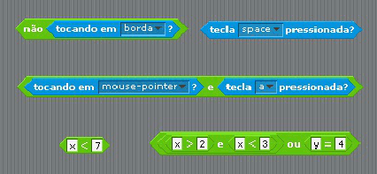

Chapter 2
======

## Lógica proposicional

> "Poder-se-á definir a Lógica como a ciência das regras que legitimam
a utilização da palavra portanto." B. Ruyer in Logique.

### Proposição

No caso das instruções *if* e *while*, a execução dum bloco de código está dependente da avaliação duma função proposicional (condição). Com o objectivo de estudar estas instruções e formalizar a noção de função proposicional começa-se por rever algumas noções de lógica proposicional e do cálculo de predicados.

Os elementos básicos da lógica são as *proposições* ou *sentenças* que se entendem como afirmações precisas. Na lógica clássica, que abordamos, a avaliação duma proposição é regida por dois princípios fundamentais:
- **Princípio da não contradição** - Uma proposição não pode ser simultaneamente verdadeira e falsa;
- **Princípio do terceiro excluído** - Uma proposição ou é verdadeira ou é falsa;

Por exemplo "1 é maior que 3" é uma proposição cujo valor lógico é o de
"falsidade" enquanto que "todos os triângulos têm três lados e três ângulos" é uma proposição cujo valor lógico é o de "verdade".

Por outro lado "*x < 3*" não é uma proposição (depende do valor que venha a ser atribuído à variável *x*) sendo denominada *função proposicional*.

Representam-se por letras (geralmente minúsculas) as proposições genéricas (ou variáveis proposicionais) e por 1 (ou V) e 0 (ou F) os valores lógicos de "*verdade*" e "*falsidade*", respectivamente.

A área da lógica que trata as proposições neste contexto é designada por *cálculo proposicional* ou *lógica proposicional*.

### Proposição simples e proposição composta
Por vezes combinam-se várias proposições para obter proposições mais expressivas. Neste sentido, classificamos as proposições como **simples** (também denominada atómica) ou
**composta** (também denominada molecular).

As proposições simples apresentam apenas uma afirmação:

- $p:$ $\sqrt{2}$ não é um número racional.

- $q:$ existem mais números reais que inteiros.

- $v:$ $1=2$.

- $r:2+3>4$.

As proposições compostas são definidas por uma ou por mais do que uma
proposição, usando na sua formação **operadores lógicos**
(também designados de **conectivas lógicas** ou operadores para formação de proposições):

- $x = 2$ e $y = 1$.

- se $x > y$ então $y < x$.

- não é verdade que $2+3>4$.

[Continuação](https://github.com/MelroLeandro/Matematica-Discreta-para-Hackers/blob/master/jpynb_source/Chapter2_Calculo_Proposicional/Chapter2_Calculo_Proposicional.ipynb)
